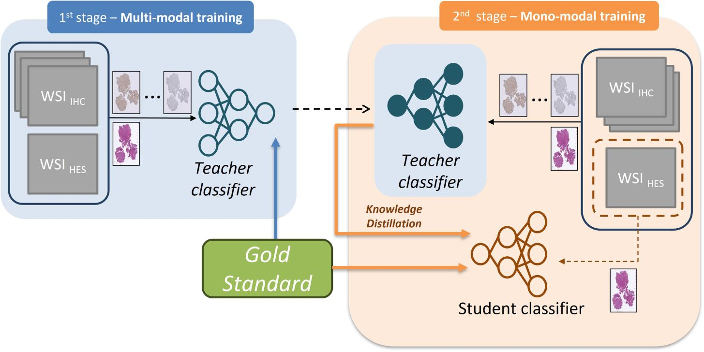

This repositery contains the code associated to the paper entitled `A Vision Transformer-Based Framework for Knowledge Transfer From Multi-Modal to Mono-Modal Lymphoma Subtyping Models` IEEE Journal of Biomedical and Health Informatics
 (2024) \
 [arxiv paper](https://arxiv.org/abs/2308.01328) \
 [IEEE paper](https://doi.org/10.1109/JBHI.2024.3407878)

 

# Dataset creation
Run `dataset.py` to extract sequences from WSI files and maunal annotations (must be QuPath exported annotations).
The annotation files must have the name as the WSI file associated and saved in directory a with stain name.

# Train multi and mono-modal models
To train the multi or mono-modal models run `train.py` while specifying the label CSV file containing the name of the slide with is class index.
To train the mlti-modal model use `--stain multi` argument, while for the mono-modal one `--stain mono`.

A very important detail: the argument `modalities` is used to specify which modalities to consider, and the first one is considered as the modality to keep after distillation.

# Test the models
Run `test.py` to test the mono-modal model.
